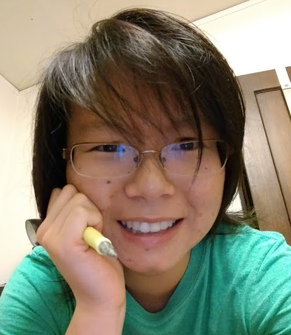

Tiffany is a 3rd year CS Major at UC Berkeley interested in applications of machine learning and the power computing can bring to various fields. She works in the Computational Approaches to Human Learning Lab at Berkeley and previously worked in the Center for Quantitative Medicine at UConn Health. In her spare time, she enjoys reading and exploring other disciplines, traveling alone, flirting with food poisoning, and cooking for family and friends.